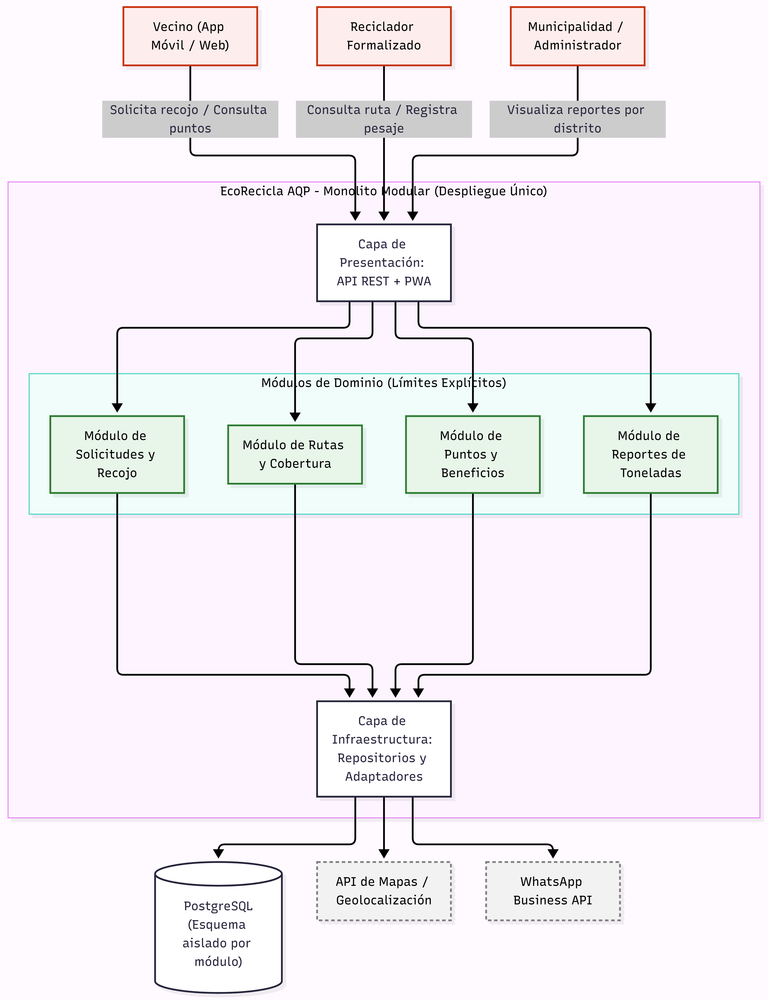
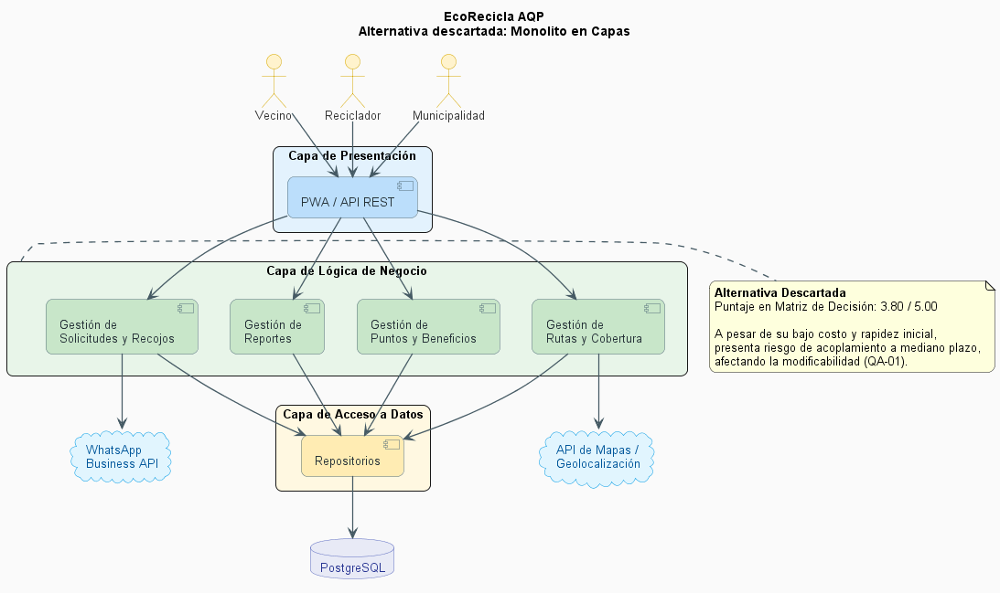
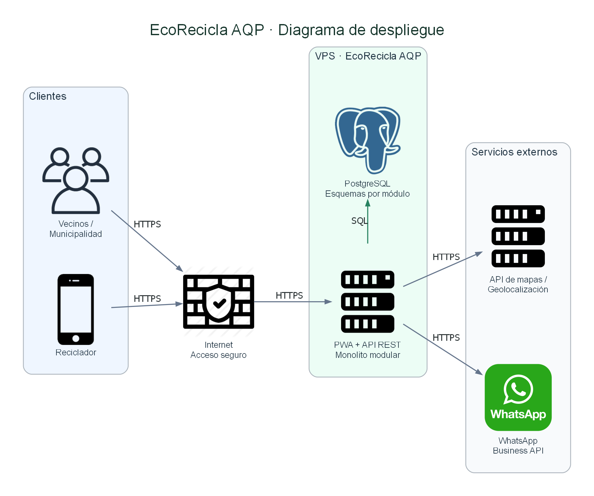

# EcoRecicla AQP — Grupo 10

## 1. Descripción del caso

EcoRecicla AQP es una propuesta de sistema orientada a apoyar la gestión del reciclaje en Arequipa. El sistema permite que los vecinos soliciten recojos de residuos reciclables, que los recicladores consulten sus rutas y registren las entregas realizadas, y que la municipalidad consulte reportes de toneladas recicladas.

El atributo de calidad crítico identificado es la **modificabilidad**, debido a que el sistema debe permitir incorporar nuevos distritos o nuevas reglas de canje de puntos en un máximo de 2 días-persona sin afectar los demás módulos.

---

## 2. Integrantes y roles

| Integrante | Rol / Responsabilidad |
|---|---|
| Paola Adamari Mayta Quispe | Diagramas arquitectónicos, despliegue y bitácora de IA |
| Joselin Sharon Condori Catunta | Drivers arquitectónicos, matriz de decisión y ADR |

## 3. Arquitectura seleccionada

Luego de evaluar las alternativas **Monolito en Capas**, **Microservicios** y **Monolito Modular**, se seleccionó **Monolito Modular**.

Esta alternativa permite mantener un único despliegue y una operación sencilla, pero separando las funcionalidades mediante módulos de dominio con límites explícitos.

Los módulos principales son:

- Solicitudes y Recojo
- Rutas y Cobertura
- Puntos y Beneficios
- Reportes de Toneladas

### Diagrama de arquitectura

---

## 4. Decisiones arquitectónicas

Las principales decisiones del proyecto se encuentran documentadas mediante ADR:

- [ADR-001 — Adopción del Monolito Modular](docs/architecture/adr/001-estilo-arquitectonico.md)
- [ADR-002 — PostgreSQL con esquemas aislados por módulo](docs/architecture/adr/002-base-datos.md)
- [ADR-003 — Progressive Web App (PWA)](docs/architecture/adr/003-aplicacion-frontend.md)

---

## 5. Alternativa descartada

Como segunda alternativa se evaluó un **Monolito en Capas**. Aunque ofrece simplicidad y rapidez inicial, se descartó frente al Monolito Modular debido a que este último permite establecer límites de dominio más explícitos y responde mejor al atributo crítico de modificabilidad.

---

## 6. Diagrama de despliegue

El despliegue propuesto utiliza un VPS para alojar la PWA, la API REST y el Monolito Modular. PostgreSQL almacena los datos mediante esquemas por módulo y el sistema se comunica mediante HTTPS con servicios externos de mapas/geolocalización y WhatsApp Business API.

---

## 7. Uso de Inteligencia Artificial

Durante el laboratorio se utilizó IA como herramienta de apoyo para analizar alternativas arquitectónicas, revisar decisiones y generar propuestas de Diagram as Code.

Todas las propuestas fueron verificadas por el equipo antes de ser aceptadas. El registro detallado se encuentra en:

[Bitácora de uso de IA](docs/architecture/bitacora-ia.md)

---

## 8. Reflexión del equipo

El desarrollo de este laboratorio nos permitió comprender que seleccionar una arquitectura no consiste únicamente en elegir la tecnología más avanzada, sino en analizar los requisitos, atributos de calidad y restricciones reales del proyecto. La matriz de decisión nos ayudó a comparar las alternativas de manera más objetiva y justificar la elección del Monolito Modular. También aprendimos a documentar las decisiones mediante ADR y a representar la arquitectura utilizando Mermaid, PlantUML y Python Diagrams. El uso de IA permitió acelerar algunas actividades, pero comprobamos que sus propuestas deben ser verificadas antes de incorporarlas al proyecto. Finalmente, entendimos la importancia de mantener los diagramas y decisiones arquitectónicas versionados junto con el código.