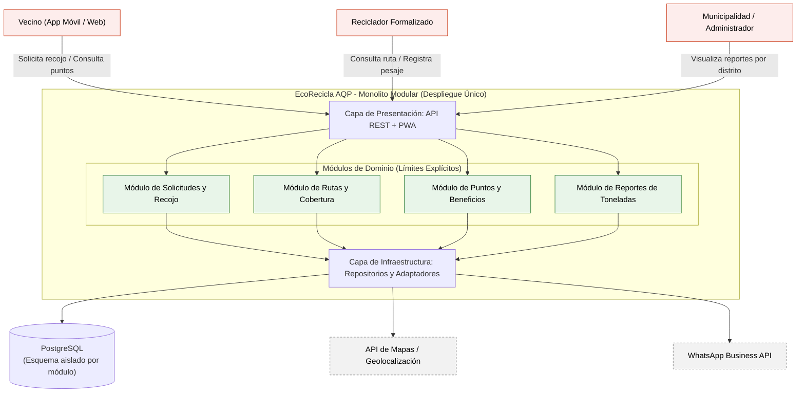

# Arquitectura

```mermaid
flowchart TB

    %% Actores
    VEC["Vecino (App Móvil / Web)"]
    REC["Reciclador Formalizado"]
    MUN["Municipalidad / Administrador"]

    %% Monolito Modular
    subgraph APP["EcoRecicla AQP - Monolito Modular (Despliegue Único)"]
        API["Capa de Presentación: API REST + PWA"]

        subgraph MODS["Módulos de Dominio (Límites Explícitos)"]
            M1["Módulo de Solicitudes y Recojo"]
            M2["Módulo de Rutas y Cobertura"]
            M3["Módulo de Puntos y Beneficios"]
            M4["Módulo de Reportes de Toneladas"]
        end

        INF["Capa de Infraestructura: Repositorios y Adaptadores"]
    end

    %% Base de datos y servicios externos
    DB[("PostgreSQL<br/>(Esquema aislado por módulo)")]
    MAPS["API de Mapas / Geolocalización"]
    WAPP["WhatsApp Business API"]

    %% Flujos de interacción
    VEC -->|Solicita recojo / Consulta puntos| API
    REC -->|Consulta ruta / Registra pesaje| API
    MUN -->|Visualiza reportes por distrito| API

    API --> M1
    API --> M2
    API --> M3
    API --> M4

    M1 --> INF
    M2 --> INF
    M3 --> INF
    M4 --> INF

    INF --> DB
    INF --> MAPS
    INF --> WAPP

    %% Estilos
    classDef mod fill:#E8F5E9,stroke:#2E7D32,color:#000
    classDef ext fill:#F2F2F2,stroke:#7F7F7F,color:#000,stroke-dasharray:4 3
    classDef usr fill:#FDEDEC,stroke:#C8310E,color:#000

    class M1,M2,M3,M4 mod
    class MAPS,WAPP ext
    class VEC,REC,MUN usr
```
